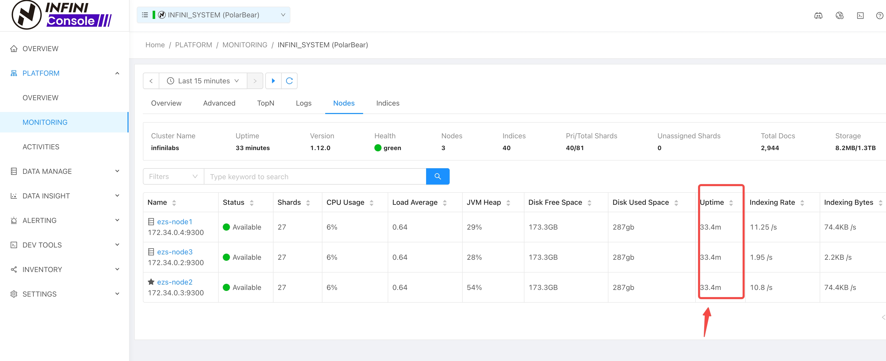
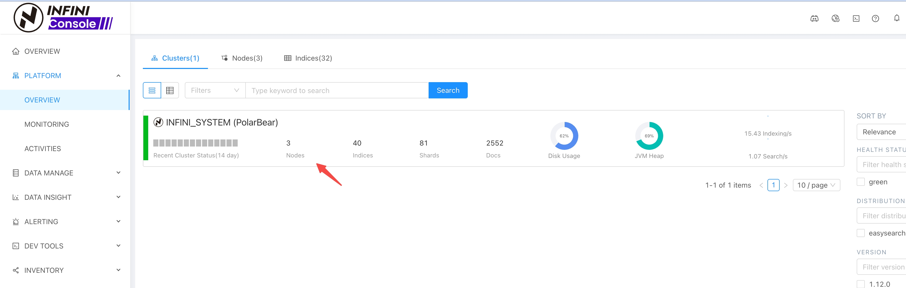

## 背景介绍

运行 **INFINI Console 1.29.0 和 1.29.1 版本** 的用户在 **新初始化** 平台后可能会遇到一个特定问题。如果后台的系统 Easysearch/Elasticsearch 集群（存储 Console 元数据的集群，通常名为 `.infini_cluster` 或类似名称）包含**超过一个节点**，Console UI 可能会错误地报告系统集群健康状态异常（例如，显示为不可用）。

这是这些版本在特定条件下（新初始化的、多节点的系统集群）的一种显示或状态检测上的问题。底层的 Easysearch/Elasticsearch 集群本身的健康状态通常是绿色 (green) 的。



下面我们提供了一个简单的变通方法来修正 INFINI Console 中显示的状态，通过 INFINI Console 自带的开发工具操作即可。

## 问题现象

*   INFINI Console UI 中“系统集群”的健康状态指示器显示为不可用。
*   伴随的文本可能指示“异常”或不健康状态。
*   直接检查 Easysearch/Elasticsearch 系统集群的健康状态（例如，通过 `GET _cluster/health`）显示 `status: green`。
*   此问题仅在 1.29.0 或 1.29.1 版本、**新初始化** 部署且系统 Easysearch/Elasticsearch 集群中**有多个节点**的情况下观察到。

## 解决方案

解决方法涉及更新 `.infini_cluster` 索引（如果您的系统集群索引名称不同，请相应调整）中的一个特定文档。该文档代表 Console 中的系统集群实体，我们需要手动将其健康状态标签设置正确。

您可以使用 Kibana Dev Tools、`curl` 或任何能够向 Easysearch/Elasticsearch 集群发送请求的工具来运行以下 `_update_by_query` 命令。

**命令:**

```json
POST /.infini_cluster/_update_by_query?conflicts=proceed
{
  "query": {
    "term": {
      "id": {
        "value": "infini_default_system_cluster"
      }
    }
  },
  "script": {
    "source": "ctx._source.labels = ['health_status': params.status]",
    "lang": "painless",
    "params": {
      "status": "green"
    }
  }
}
```

**解释:**

1.  **`POST /.infini_cluster/_update_by_query?conflicts=proceed`**: 针对 `.infini_cluster` 索引（如果您的系统集群索引名称不同，请调整）并使用 update-by-query API。`conflicts=proceed` 确保如果在查询和更新阶段之间文档被修改，操作将跳过该冲突文档而不是失败。
2.  **`query`**: 查找代表默认系统集群的特定文档，通过 `id: "infini_default_system_cluster"` 来识别（如果您使用了自定义名称，请确认此 ID）。
3.  **`script`**: 这是执行更新的核心部分。
    *   **`source: "ctx._source.labels = ['health_status': params.status]"`**: **关键之处**，这行代码尝试**设置或覆盖**一个名为 `labels` 的字段，其值为一个仅包含 `health_status` 键的 Map，该键的值来自 `params.status`。
    *   **`lang: "painless"`**: 指定脚本语言为 Painless。
    *   **`params: { "status": "green" }`**: 将所需状态（"green"）安全地传递给脚本。

## 修复后验证

成功运行 `_update_by_query` 命令后：

1.  稍等片刻，让可能的缓存失效。
2.  刷新 INFINI Console 网页界面。
3.  系统集群状态指示器现在应该正确显示为**绿色**（或正常）。



## 结论

这个变通方法解决了 INFINI Console 1.29.0 和 1.29.1 版本中，针对新初始化的多节点设置，系统集群状态显示不正确的特定表面问题。通过使用 `_update_by_query` 手动更新相关文档，您可以在 Console UI 中恢复正确的状态显示。如果初始命令未产生预期结果，请记得验证确切的字段名（`labels.health_status`）。此问题已在最新发布的 1.29.2 INFINI Console 版本中进行了修复。